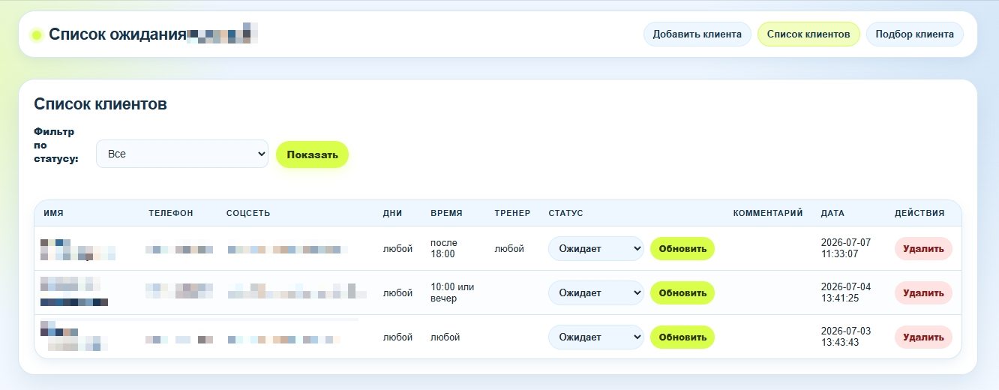
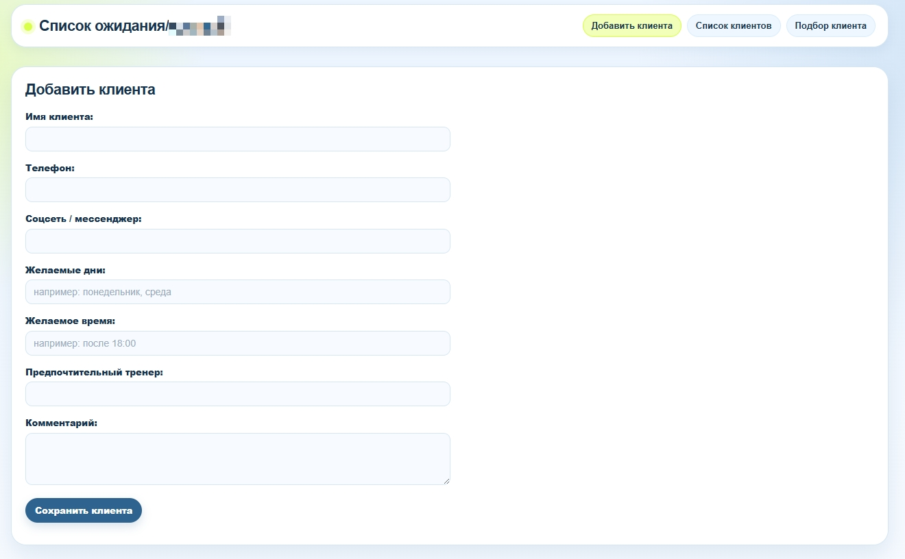
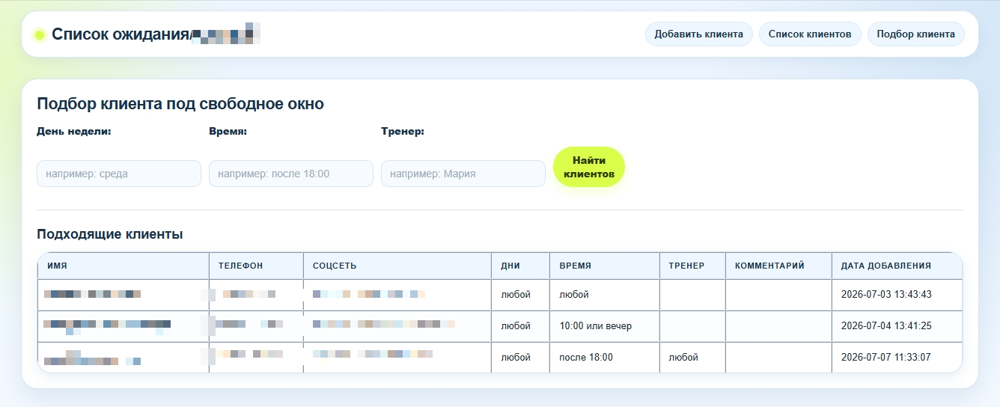

# Sports Center Waitlist


A simple Flask + SQLite web application for managing client waitlist requests in a sports center.

Built to solve a real workflow problem: administrators need a structured way to store client requests, preferences, trainer choices, comments, and current status.

---

## Features

- Add new clients to the waitlist
- Store contact information and social media links
- Track preferred days and time
- Save trainer preferences
- Update client status
- Add comments for each request
- Search and view waitlist records
- Local SQLite database
- Simple browser-based interface

---

## Tech Stack

- Python
- Flask
- SQLite
- HTML
- CSS
- Git / GitHub

---

## Project Structure

```text
sports-center-waitlist/
├── app.py
├── schema.sql
├── requirements.txt
├── start_waitlist.bat
├── static/
│   └── style.css
├── templates/
│   ├── base.html
│   ├── clients.html
│   ├── add_client.html
│   └── search_clients.html
└── README.md
```

---

## How to Run Locally

Clone the repository:

```bash
git clone https://github.com/rootless-user/sports-center-waitlist.git
cd sports-center-waitlist
```

Create and activate a virtual environment:

```bash
python3 venv .venv
source .venv/bin/activate
```

Install dependencies:

```bash
pip install -r requirements.txt
```

Run the application:

```bash
python app.py
```

Open in browser:

```bash
http://127.0.0.1:5000
```

---

## Windows Launch

The project includes a simple .bat file for launching the app on Windows:

```bash
start_waitlist.bat
```

## Screenshots

| Client List | Add Client |
|------------|------------|
|  |  |

| Search Page |
|-------------|
|  |


